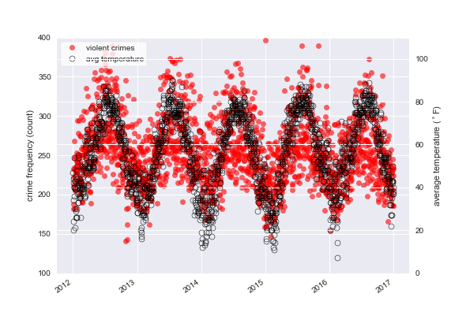

# Sunny with a Chance of Murder
## Data Munging and Analysis with NYC Weather and Crime Data Sets

This notebook is another self-contained, just-for-fun side project to use public data sets (NYC crime data and weather data) to examine the following questions:

  1. What connections can we find between crime rates and weather?  Do crime rates rise with rising  average daily temperature?
  2. What effect does the lunar cycle have on crime rates?  My grandparents always insisted that the full moon turned people into -- well, lunatics.  And they had an abundance of anecdotal evidence to back up their claim.  But what do the data tell us?  
    * The question isn't quite as crazy or supernatural as it sounds.  Perhaps criminals are more likely to burglarize homes when they can see by the light of the moon, without the use of attention-grabbing flashlights.  (On the other hand, perhaps they're _less_ likely to burglarize when their every move is illuminated by the light of the full moon.)  We'll examine the data without prejudice, and without making any statements about my grandparents' credulity.
  3. Are crimes more likely to occur on weekdays vs weekends?  Is the _type_ of crime important for this question?
  4. What's the statistical significance of the differences we identify (if any)?
